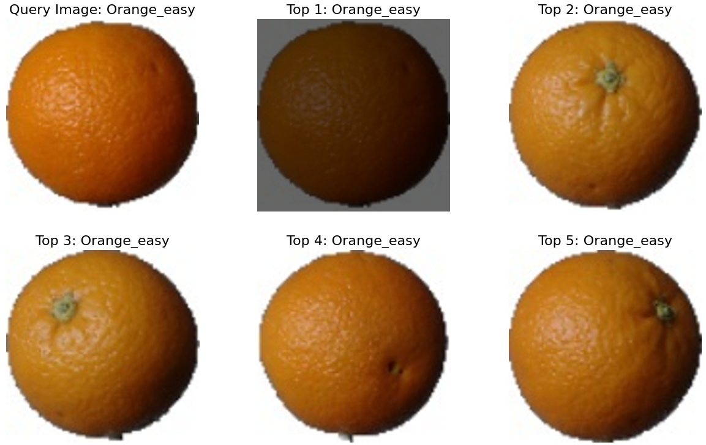

# Image Retrieval Project

This project implements basic image retrieval techniques using various similarity measures. It's designed to compare a query image against a database of images and return the most similar ones.

## Table of Contents
- [Features](#features)
- [Requirements](#requirements)
- [Installation](#installation)
- [Usage](#usage)
- [Implemented Methods](#implemented-methods)
- [License](#license)

## Features
With 3 ways to implement this project: 
1. Basic 
2. Using CLIP to encode image information 
3. Using Chromadb - Vector Database

- Load and preprocess images from a structured dataset
- Implement multiple similarity measures for image comparison:
  - Absolute Difference (L1 Distance)
  - Mean Square Difference (L2 Distance)
  - Cosine Similarity
  - Correlation Coefficient
- Visualize query results with matplotlib

## Requirements

- Python 3.x
- NumPy
- Pillow (PIL)
- Matplotlib

## Installation

1. Clone this repository:
   ```
   git clone https://github.com/yourusername/image-retrieval-project.git
   cd image-retrieval-project
   ```

2. Install the required packages:
   ```
   pip install numpy Pillow matplotlib
   ```

3. Download the dataset:
   ```
   gdown 1msLVo0g0LFmL9-qZ73vq9YEVZwbzOePF
   unzip data
   ```

## Usage

1. Ensure your dataset is structured as follows:
   ```
   data/
   ├── train/
   │   ├── class1/
   │   ├── class2/
   │   └── ...
   └── test/
       ├── class1/
       ├── class2/
       └── ...
   ```

2. Run the Jupyter notebook:
   ```
   jupyter notebook Project_ImageRetrieval_Basic/PretrainedCLIP/VectorDatabase.ipynb
   ```

3. Follow the notebook cells to execute different similarity measures and visualize results.

## Implemented Methods

1. **Absolute Difference (L1 Distance)**
   - Function: `absolute_difference()`
   - Calculates the sum of absolute differences between pixel values.

2. **Mean Square Difference (L2 Distance)**
   - Function: `mean_square_difference()`
   - Calculates the mean of squared differences between pixel values.

3. **Cosine Similarity**
   - Function: `cosine_similarity()`
   - Measures the cosine of the angle between image vectors.

4. **Correlation Coefficient**
   - Function: `correlation_coefficient()`
   - Calculates the Pearson correlation coefficient between image vectors.

Each method is implemented in a separate function and can be used to retrieve similar images from the dataset.

## Screenshots
<div align="center">
   
   
   
</div>
